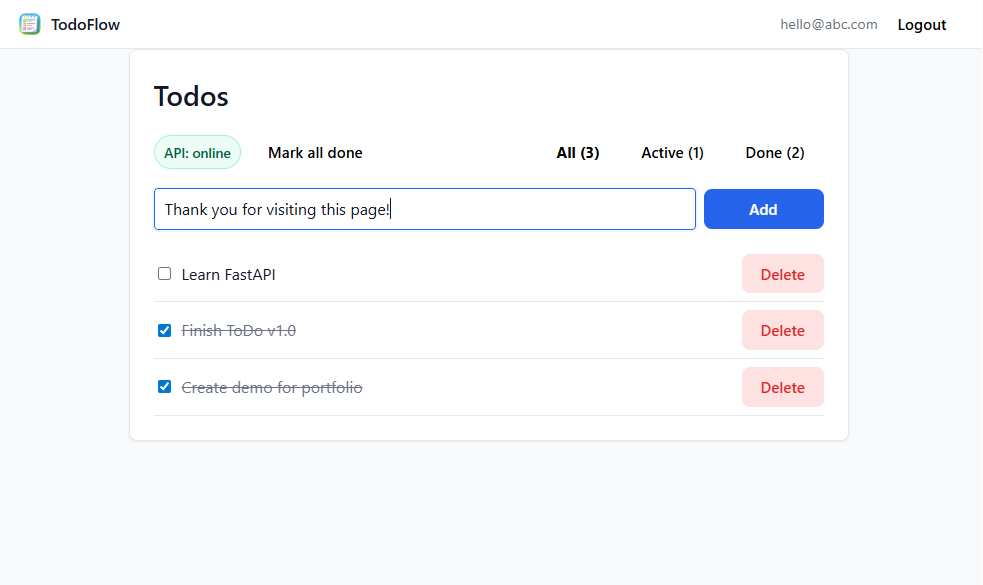

# Upgraded TodoFlow (Flask + React)

A small full-stack todo app with JWT authentication and tests.

- Backend: Flask (app factory + blueprints), SQLAlchemy, JWT
- Frontend: React (Vite) + React Router
- DB: SQLite by default; Postgres via `DATABASE_URL`
- Testing: pytest (backend), Vitest + Testing Library (frontend)

## Demo

- Live site (Netlify): `https://portfolio-todo-georgy29.netlify.app`
- API health (Render): `https://portfolio-todo-njj4.onrender.com/api/ping`

## Screenshot (click the image)
[](https://portfolio-todo-georgy29.netlify.app)


## What changed over time

This repo started as a simple Flask todo app using a local SQLite file. Over time, I added:

- Flask blueprints (`api/routes/`) and an app factory (`api/app.py`)
- Postgres support via `DATABASE_URL` + Alembic migrations (`api/migrations/`)
- Docker Compose for a reproducible local Postgres environment (`docker-compose.yml`)
- Backend tests with pytest (`api/tests/`)
- Frontend tests with Vitest (`client/src/**/*.test.jsx`)

## Repo layout

- `api/` — Flask API
- `api/routes/` — blueprints (`auth`, `todos`, `health`)
- `api/migrations/` — Alembic migrations
- `client/` — React app
- `docker-compose.yml` — Postgres + API

## Run locally (recommended)

Prereqs: Docker + Node.js.

1) Start API + Postgres:
```bash
docker compose up --build -d
```

2) Start the frontend:
```bash
cd client
npm install
npm run dev
```

Open:
- Frontend: `http://localhost:5173`
- API health: `http://localhost:5000/api/ping`

## Run locally (no Docker, SQLite)

Prereqs: Python 3.12.

```bash
python3 -m venv api/.venv
source api/.venv/bin/activate
pip install -r api/requirements.txt

# optional
cp api/.env.example api/.env.local

python -m api.app
```

# Optional commands/information
## Environment variables

Backend (`api/.env.example`):
- `JWT_SECRET_KEY` (required in production)
- `FRONTEND_ORIGIN` (optional CORS allowlist)
- `DATABASE_URL` (optional; enables Postgres)

Frontend (`client/.env.example`):
- `VITE_API_BASE` (production API base URL)

## Migrations (Alembic)

Apply the latest migrations:
```bash
alembic -c api/alembic.ini upgrade head
```

Create a new migration after changing models:
```bash
alembic -c api/alembic.ini revision --autogenerate -m "your message"
```

## Tests

Backend:
```bash
source api/.venv/bin/activate
pytest -q
```

Frontend:
```bash
cd client
npm test
```

## Useful commands

Postgres shell:
```bash
docker compose exec db psql -U pingpong -d pingpong
```

List tables:
```bash
docker compose exec db psql -U pingpong -d pingpong -c "\\dt"
```

## API endpoints

- `GET /api/ping`
- `POST /api/auth/register`
- `POST /api/auth/login`
- `GET /api/me` (Bearer token)
- `GET /api/todos` (Bearer token)
- `POST /api/todos` (Bearer token)
- `PATCH /api/todos/<id>` (Bearer token)
- `DELETE /api/todos/<id>` (Bearer token)

## Deployment notes

- Backend: Render (run command: `gunicorn api.app:create_app()`)
- Frontend: Netlify
- For persistence in production, use managed Postgres and set `DATABASE_URL`.
